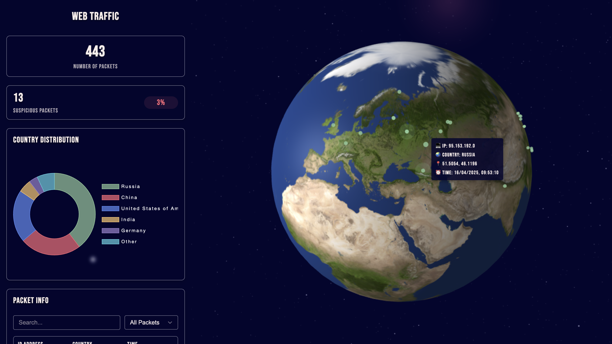

# Web-traffic

The website that represent packets sent from different countries.

### How to run?

1. Run docker

```
cd web-traffic
docker-compose up
```

2. Open the web-page
   http://127.0.0.1:5555


